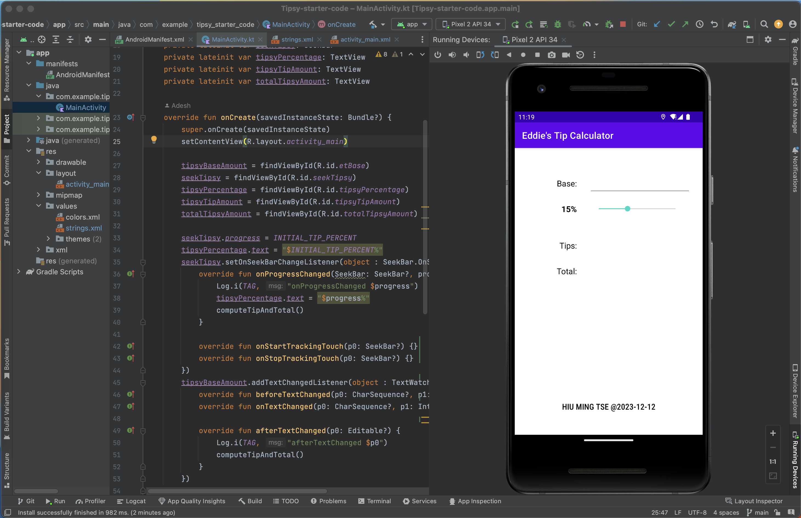
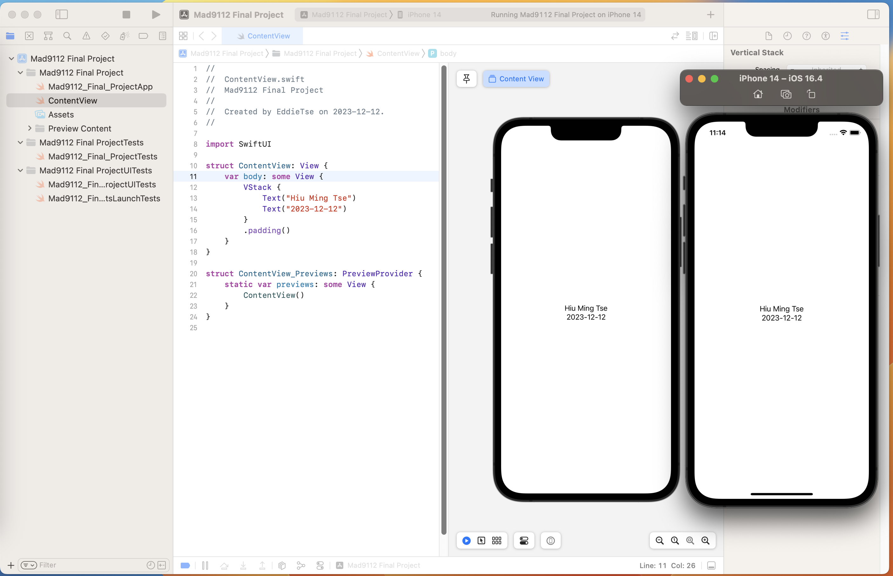
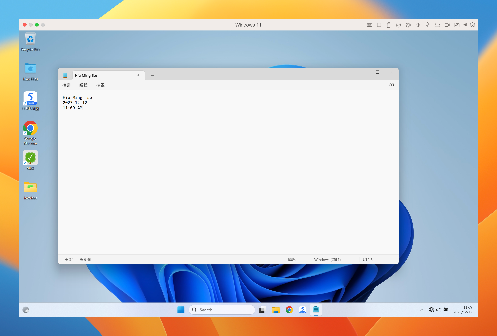

# HiuMing_Tse_FinalProject

## Step 1: Code
```
function getDaysUntilChristmas(){
    const today = new Date()
    const yearOfToday = today.getFullYear();
    const monthOfToday = today.getMonth() + 1;
    const dateOfToday = today.getDate();
    const todayS = new Date(`${monthOfToday}/${dateOfToday}/${yearOfToday}`);
    
    const christmasS = new Date(`12/25/${yearOfToday}`);
    const diff = (christmasS - todayS) / 1000 / 3600 / 24;
    return diff
}

```

## Step 2: Android studio


## Step3: iOS Screenshots


## Step4: parallels Screenshot
